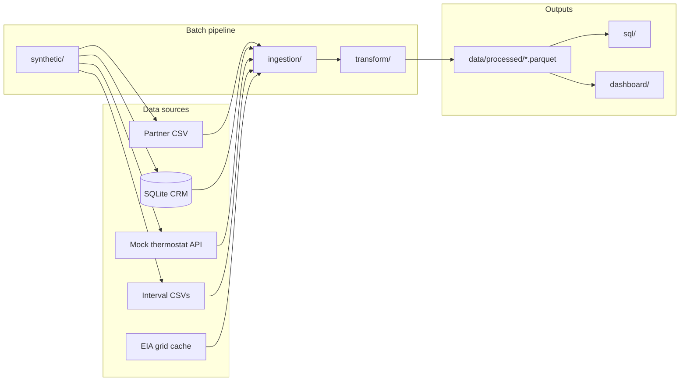

# Voltus Residential VPP Analytics

End-to-end analytics platform for a **residential Virtual Power Plant (VPP)** — the kind of system energy companies use to enroll smart thermostat customers, dispatch demand-response (DR) events, measure load reduction, and reconcile partner settlements.

This repository is a **complete demo pipeline**: synthetic multi-source data, realistic data-quality problems, batch ETL, SQL analytics, automated tests, and a Streamlit operations dashboard.

---

## What problem does this solve?

Utility-backed VPP programs pull data from many places that do not line up cleanly:

| Source | What it contains | Typical issues |
|--------|------------------|----------------|
| Partner enrollment portal | Customer sign-ups, device serials | Mixed date formats, inconsistent status values |
| Internal CRM database | Customers, programs, DR events | Leading-zero account IDs, duplicate emails |
| Thermostat partner API | Device telemetry, connectivity | Missing devices, underscore vs dash IDs |
| Utility interval meters | 15-minute kWh reads | Gaps, estimated reads, negative values |
| EIA grid data | ISO-level demand context | API rate limits, caching needs |

This project shows how an analytics team **ingests, cleans, joins, and reports** on that mess — producing enrollment funnel metrics, event performance (MW called vs delivered), interval data quality scores, and settlement views.

**Important:** Data is **batch, not streaming**. The pipeline writes static parquet files; the dashboard reads those snapshots. Re-run the pipeline to refresh numbers.

---

## Architecture



### Pipeline stages

| Step | Script | Purpose |
|------|--------|---------|
| 1 | `synthetic/generate_enrollment_csv.py` | 8,000 enrollment rows with intentional quality issues |
| 2 | `db/seed_database.py` | SQLite CRM: 6,500 customers, 8 DR events |
| 3 | `synthetic/generate_interval_data.py` | Interval meter files per event |
| 4 | `synthetic/mock_thermostat_api.py` | Flask API on port 5001 (7,200 devices) |
| 5 | `ingestion/05_ingest_eia_api.py` | Grid demand (cache-first) |
| 6 | `ingestion/01_clean_all_sources.py` | Clean all sources → parquet |
| 7 | `transform/02_link_entities.py` | Join sources → `vpp_master.parquet` |
| 8 | `transform/03_compute_cbl_and_performance.py` | HighXofY CBL → `cbl_performance.parquet` |

Run everything with one command:

```bash
python run_pipeline.py
```

Target runtime: **under 60 seconds** on a typical laptop.

---

## Quick start (first time)

### Prerequisites

- **Python 3.11+** (3.12 or 3.13 recommended)
- **git**

### 1. Clone and enter the project

```bash
git clone https://github.com/YOUR_USERNAME/voltus-vpp-analytics.git
cd voltus-vpp-analytics
```

### 2. Create a virtual environment

```bash
python -m venv .venv
source .venv/bin/activate        # macOS / Linux
# .venv\Scripts\activate         # Windows
```

### 3. Install dependencies

```bash
pip install -r requirements.txt
```

### 4. Environment variables (optional)

```bash
cp .env.example .env
```

An EIA API key is **not required** for first run — cached grid data ships in `data/eia_cache/`. Set `EIA_API_KEY` only if you want to pull fresh EIA data.

Get a free key: [https://www.eia.gov/opendata/register.php](https://www.eia.gov/opendata/register.php)


## Dashboard

The Streamlit app is the primary way to explore results. Five tabs mirror the business questions operations teams ask:

| Tab | Question |
|-----|----------|
| **Enrollment Funnel** | How many customers move from signup → active participation? |
| **Partner & Device Summary** | Which OEM partners are growing? Are devices online? |
| **Event Performance** | MW called vs delivered per DR dispatch |
| **Interval Data Quality** | Actual vs estimated vs missing meter reads |
| **Settlement Reconciliation** | CBL vs actual load, incentives owed |

### Sidebar filters

- **ISO market** → dynamically limits **utility zone** options (PJM / MISO / NYISO mapping)
- **Partner**, **enrollment date range**
- Filters persist across tabs via session state


## Project structure

```text
voltus-vpp-analytics/
├── run_pipeline.py              # One-command end-to-end runner
├── dashboard/
│   └── streamlit_app.py         # Operations dashboard
├── synthetic/                   # Data generators + mock API
├── db/
│   ├── schema.sql               # CRM table definitions
│   └── seed_database.py         # Populate SQLite
├── ingestion/                   # Clean raw sources
├── transform/                   # Entity linking + CBL performance
├── sql/                         # Redash-ready analytics queries
├── tests/                       # pytest data quality & join tests
├── data/
│   ├── eia_cache/               # Shipped EIA cache (no API key needed)
│   ├── raw/                     # Generated CSVs (gitignored)
│   └── processed/               # Parquet outputs (gitignored)
└── requirements.txt
```

---

## Key outputs

| File | Description |
|------|-------------|
| `enrollment_clean.parquet` | Standardized partner portal enrollments |
| `vpp_master.parquet` | Customer × event grain master table |
| `cbl_performance.parquet` | Baseline load + event performance per customer |
| `interval_clean.parquet` | Cleaned 15-minute meter intervals |
| `voltus_internal.db` | CRM: customers, programs, partners, DR events |

---


## Tech stack

Python · pandas · pyarrow · SQLite · Flask (mock API) · Streamlit · Plotly · pytest

---

## License

MIT (or update this section for your preferred license.)
